# Project Overview
- Dataset used: MRBrainS18
- 148 is used as validation
# About dataset
| _Classes_ |label|
| :-------: | :-------: |
| Cortical gray matter|1|
| Basal ganglia|2|
| White matter|3|
| White matter lesions|4|
| Cerebrospinal fluid in the extracerebral space|5|
| Ventricles|6|
| Cerebellum|7|
| Brain stem|8|
# Preprocessing steps
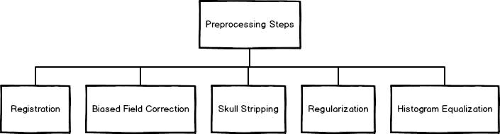
<ul>
&nbsp
<li>Registered and Bias Field Correction was already done in the dataset
<li>Skull stripping was done only for T1 weighted MRI using DeepBrain library which creates a mask for skull removal.
<li>Furthermore, contrast of T1 weighted MRI was improved using Histogram Equalization technique
</ul>

| 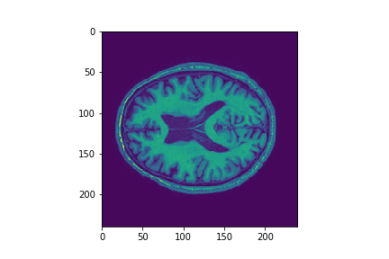 | 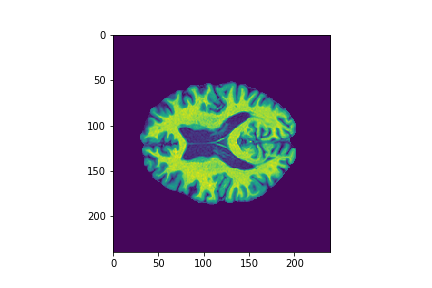| 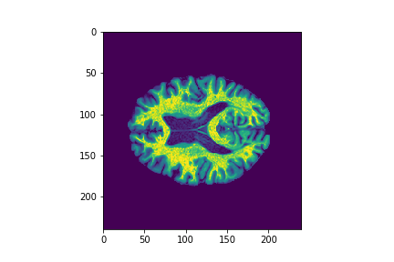 |
| :----------------------------------------------------------: | :----------------------------------------------------------: | :----------------------------------------------------------: |
|            Regularized Biased Field Corrected MRI            | Removed Skull | Histogram equalization |

# Approach
### Cortical gray matter, White matter, Cerebrospinal fluid in the extracerebral space

Cortical gray matter, White matter, Cerebrospinal fluid in the extracerebral space can be easily reduced by appling thresholding to T1- weighted MRI further a small U-Net was used to denoise the threshold image.
  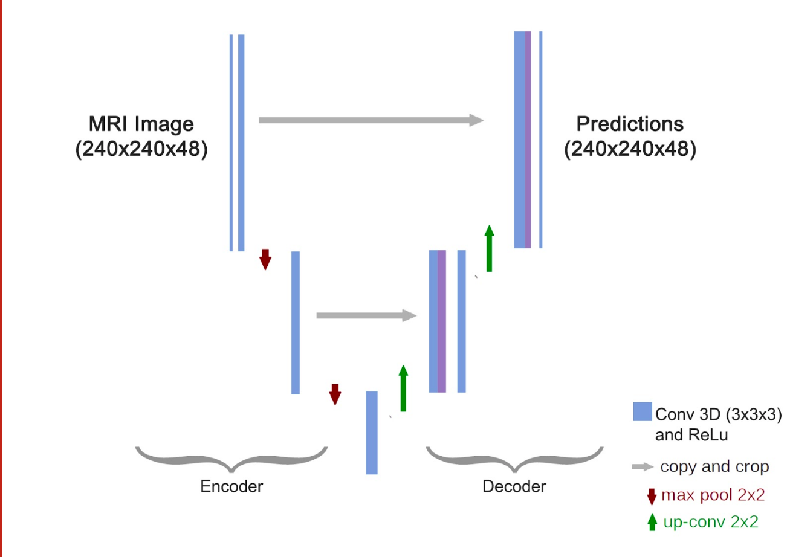

Total parameters: 60,553
&nbsp

### Rest

For rest of the classes training was done on a custom model inspired by Unet Architecture. The model has 3 encoders stacked together in bottleneck layer and then a single decoder. There are skip connections from encoder to decoder to enhance segmentation.
  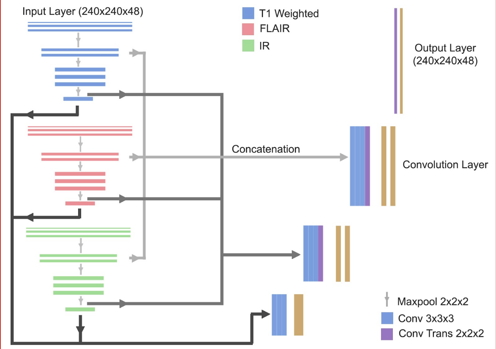

Total parameters: 151,717

### Key difference between U-Net and Architecture used
| U-Net | Architecture used |
| :-------: | :-------: |
| Only one encoder and one decoder| Three encoder and one decoder|
| Deep architecture with about 10 Million parameters | Shallow with about 600 Thousands parameters|
| Doesn’t have dilated convolution layers | Has dilated convolution layers|

# Loss Function
Dice coefficient is used as Loss function in final training though Jaccard distance and crossentropy were also tried.

# Learning Curves

 
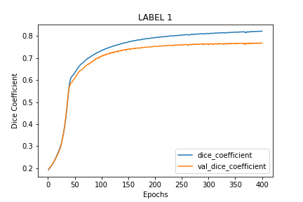 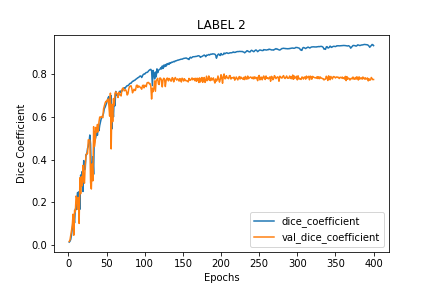
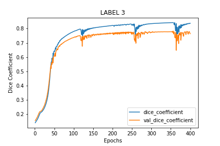 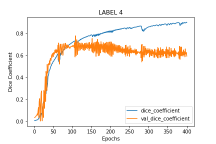
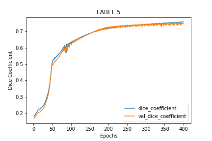 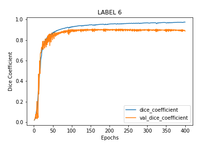
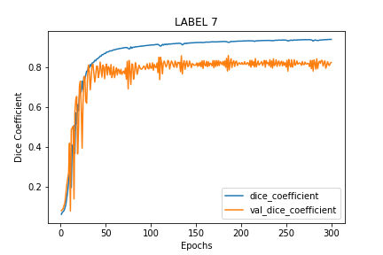 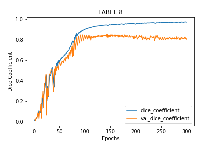

 

# Results (On Validation Data)
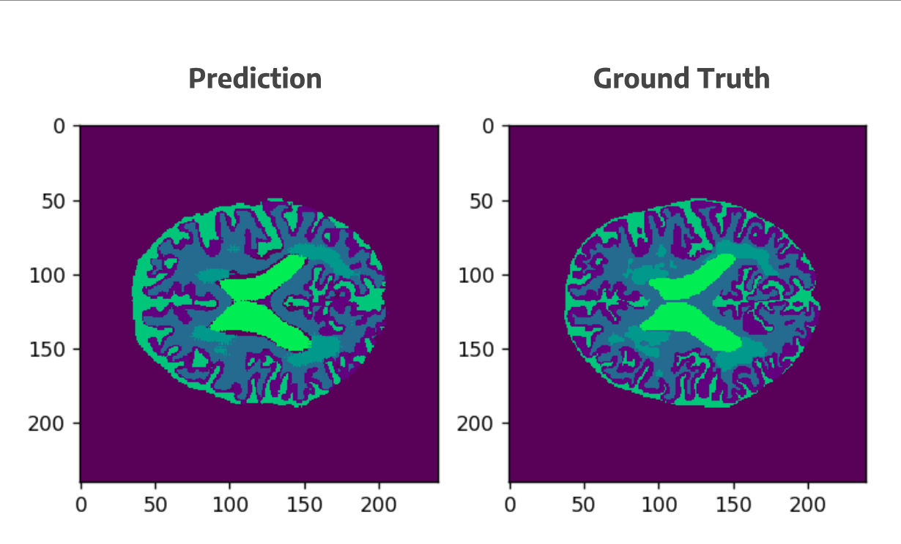 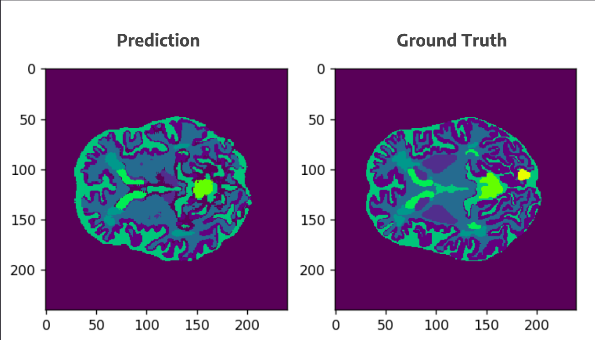 

| *Label* | 1 | 2 | 3 | 4 | 5 | 6 | 7 | 8 |
| :-----: | :-----: | :------: | :-------: | :-------: | :-------: | :-------: | :-------: | :-------: | 
| *Dice coefficient* | 0.702 | 0.758 | 0.770 | 0.746 | 0.704 | 0.882 | 0.887 | 0.855 |

# References

- Generalised Dice overlap as a deep learning loss function for highly unbalanced segmentations (<https://arxiv.org/abs/1707.03237>)
- U-Net: Convolutional Networks for Biomedical Image Segmentation (<https://arxiv.org/pdf/1505.04597.pdf>)
- MRBrainS18 (<https://mrbrains18.isi.uu.nl/>)
---
> This project was made as part of the [Smart India hackathon 2018 - Software Edition](https://www.sih.gov.in/sih2018Software), a 36 hour hackathon organised by Government of India. The problem statement was given by [Department of Atomic Energy, India](http://www.dae.nic.in/)
